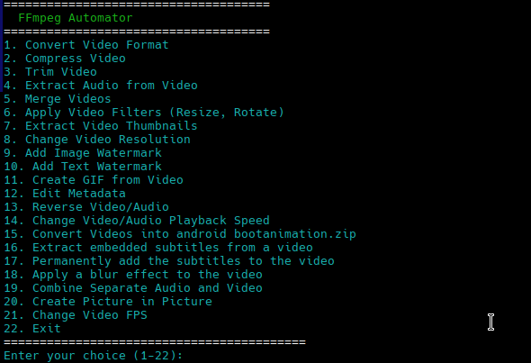
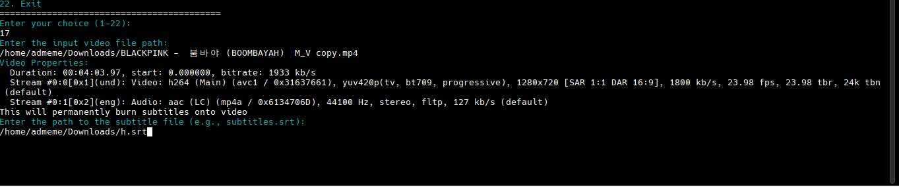
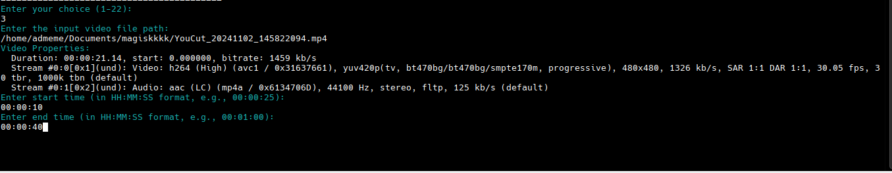
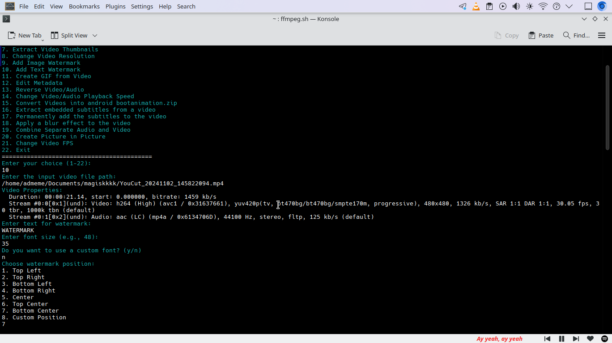

# Automated-ffmpeg-video-toolkit
Powerful shell script to simplify common FFMPEG related video editing tasks. 
Works on Termux and Linux.

## Features
- Convert videos between different formats
- Compress and reduce video size
- Cut and trim videos
- Extract audio from video files
- Merge multiple videos into one
- Apply filters (resize, rotate, blur, etc.)
- Add text or image watermarks to videos
- Create GIFs from video clips
- Edit metadata or change playback speed
- Create custom Android bootanimations
- Extract and embed subtitles
- And much more...
 ## Prerequisites

- FFmpeg
- ZIP (if you want to create bootanimation)

## Some Screenshots

- Screenshot 1




<br><br>

- Screenshot 2



<br><br>

- Screenshot 3



<br><br>

- Screenshot 4




## How To Use

- [Download The Script Directly](https://github.com/rhythmcache/Automated-ffmpeg-video-toolkit/releases/download/v1/automatedffmpeg.sh)  and run it in terminal.

- Or just copy and paste this in Linux Terminal or Termux


```
curl -sSL https://github.com/rhythmcache/Automated-ffmpeg-video-toolkit/releases/download/v1/automatedffmpeg.sh -o automatedffmpeg.sh
chmod +x ./automatedffmpeg.sh
./automatedffmpeg.sh
```


#Questions or Found Bugs ?
[ask here](https://t.me/ximistuffschat)


